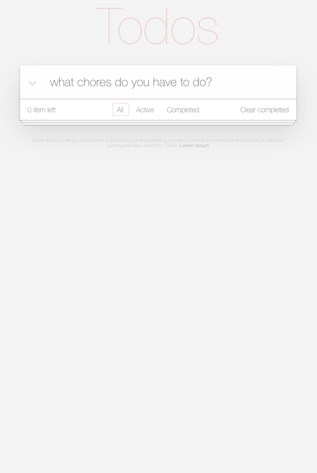
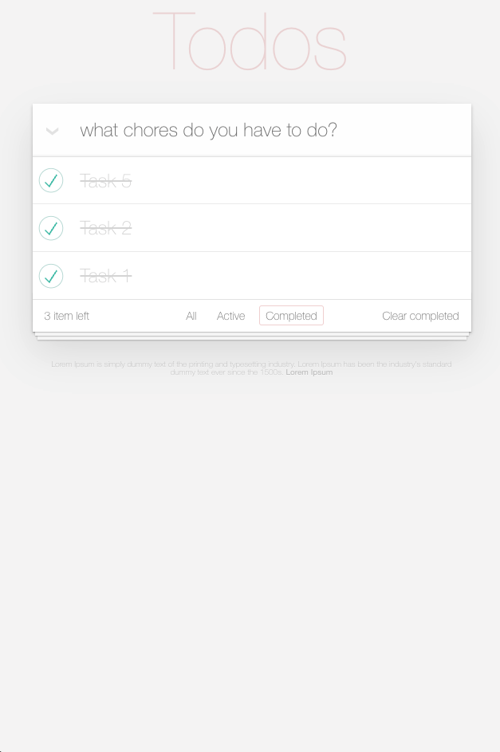

# Todo App

this application is created with the intention of showing my skills with vue and how I can adapt to different ways of working.

## Install project locally

#### 1. Clone this project to your local.
#### 2. Install dependencies.

You can use `npm i` or `yarn`

#### 2. Run project

You can use `npm run serve` or `yarn serve`

#### 2. Run tests

You can use `npm run test:watch` or `yarn test:watch`

#### Important 

I've tested for projects that didn't use a global state manager like vuex, but this is the first time I've tested an environment with these features.

I used vue with decorators because they force me to use vue in a more optimal way.

I also use Typescript since I can have better control of the data that goes in and out of the functions and components, this reduces the probability of typos and is more efficient.

Thanks...

# Views

